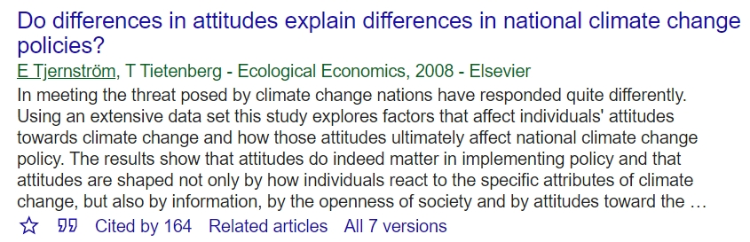
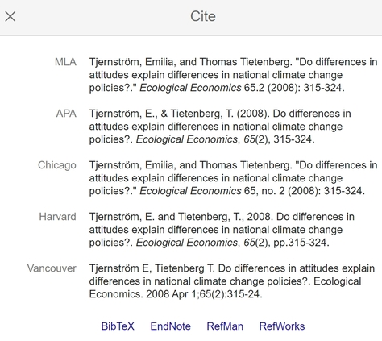
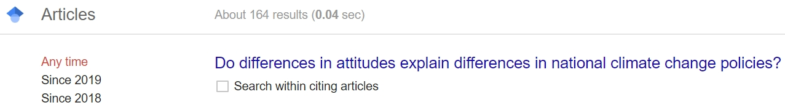

# Google Scholar & Google data

## Google Scholar tips and tricks

A few things to know about Google Scholar:

1. Results are not ordered willy-nilly: they are listed in _rank order_ based
on some combination of how often the article is viewed, how many other
articles it is connected to (i.e. citations), and how influential those
other articles are.
> If you find yourself looking at page 5 of the search, you are probably looking at less influential articles. That is not necessarily wrong or bad, but a good thing to know. There might be a reason why other scholars do not cite that article

2. When you view an article in Google Scholar, there are several useful
links below it:   
   
  2.1 The quotation marks on the left pull up a complete citation for the article, in several different formats. 
    

  2.2 Clicking "[Related articles](https://scholar.google.com/scholar?q=related:oLeukJQbX4kJ:scholar.google.com/&scioq=Do+differences+in+attitudes+explain+differences+in+national+climate+change+policies%3F&hl=en&as_sdt=0,5)" reveals articles that google's algorithm has picked as similar to the original article. This can be very useful at the beginning of your literature review.  

  2.3 "[Cited by](https://scholar.google.com/scholar?cites=9898660830880118688&as_sdt=2005&sciodt=0,5&hl=en)" shows you all articles that cite the original article.

  2.4 My favorite thing about Google Scholar: when you click on "Cited by," you get a searchable list of articles that cite the original article!

  

  And if you check the box "Search within citing articles," anything you type
    in the search field will return results within the set of articles
    that cite the first article. **This is very powerful.** For example, you may know about one or two seminal articles in the field, but they are a bit old and you want to learn about more recent research.

  2.5 _Advanced search:_ if you click the burger menu in the top left corner of google scholar, you will get access to a menu that includes Advanced Search.
  

  Here, you can specify that you want to search for your keywords in (for example) the author field, or specify that some terms must appear, etc.

  You can also specify a publication date range. This can be very useful if you are searching for keywords that may also be an author name.
   > For example, if you were doing a cost-benefit analysis on wolf hunting regulations, you may want to search for articles that include the words "wolf" and "hunt" in the text or title, but you would not necessarily be interested in articles written by a Dr. Hunt, or a Professor Wolf.

## Google data!

[Google's public data
search](https://www.google.com/publicdata/directory) is an amazing resource for finding publicly available data sets. It includes visualization options. You can select an indicator, the countries that you want to look at, the range of years, etc. For example, the below figure charts infant mortality against per-capita GDP in a few selected countries:

<iframe width="400" height="325" frameborder="0" scrolling="no" marginwidth="0" marginheight="0" src="https://www.google.com/publicdata/embed?ds=ife8n327iup1s_&amp;ctype=b&amp;strail=false&amp;bcs=d&amp;nselm=h&amp;met_x=indicator_136706&amp;scale_x=lin&amp;ind_x=false&amp;met_y=indicator_57206&amp;scale_y=lin&amp;ind_y=false&amp;met_c=indicator_57206&amp;scale_c=lin&amp;ind_c=false&amp;met_s=indicator_57206&amp;scale_s=lin&amp;ind_s=false&amp;idim=country:2103:4103:10403:20003:22103:7703:1603:4003:4703:5803:13603:15103:6303&amp;ifdim=country&amp;tunit=Y&amp;pit=1379048400000&amp;hl=en_US&amp;dl=en_US&amp;ind=false&amp;icfg&amp;iconSize=0.5">
</iframe>

There is also [Google Dataset Search](https://toolbox.google.com/datasetsearch), which has a wider range of data sets, but they are not all in the public domain. It can still be tremendously useful for learning about data sources.
