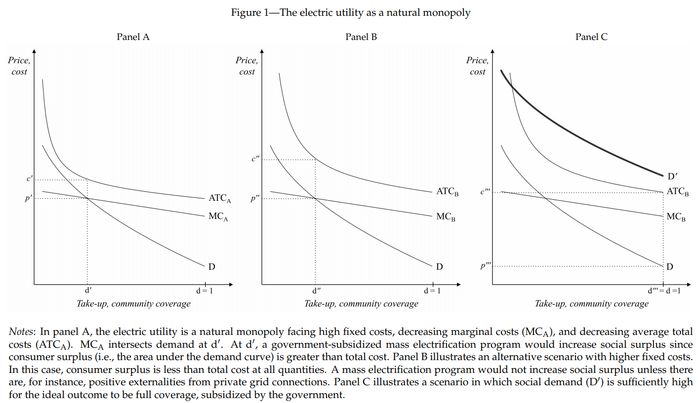

# Welcome to PA 881
## International Cost-Benefit Analysis | Fall 2019
### Syllabus


 |    Class details                  | Instructor details       |         
 |     ---                           |            --           |      
 | Meeting time: MW 8-9:15        | Instructor: Dr. Tjernström   |
 | Meeting location: Ingraham 222 / Education L159 | Office: Taylor Hall 520      |
 | Office hours: Mondays 9:30-11:30 |  Email: tjernstroem@wisc.edu |
 | [Course website](https://etjernst.github.io/CBA/) | [Instructor website](https://www.lafollette.wisc.edu/sites/tjernstrom/) |


<p align="center" style="color:grey;"><i>
"I would add one word for any student beginning economic study<br>
who may be discouraged by the severity of the effort which the study,<br>
as he will find it exemplified here, seems to require of him <span style="color: red;">[/her*]</span>.<br>
The complicated analyses which economists endeavour to carry through<br>
are not mere gymnastic.<br>
<br>
They are instruments for the bettering of human life."</i></p>
<p align="right" style="color:grey;">
	- Pigou, Arthur C. The economics of welfare, 1920.<br>
    <span style="color:red;"> [* ]</span> = Emilia's addition</p>

### Official course description
Presents the welfare economics underpinnings for evaluating the social benefits and costs of government activities. Issues such as uncertainty, the social discount rate, and welfare weights will be discussed; case studies from the environmental, social policy, and agricultural areas will be studied.

### Official pre-requisites:
Graduate/professional standing and PA818 & PA880, or POP HLTH/ISYE 875, or AAE 635.

<p align="right" style="color:lightgrey;"> This version: September 3, 2019</p>

---
## Index

* [Introduction](#introduction)
    * [What is CBA?](#what-is-cost-benefit-analysis)
    * [Course objectives](#course-objectives)
* [Details](#details)
    * [Course requirements & grades](#course-requirements-and-grades)
        * [File naming](#file-naming-convention)
        * [Assessment](#assessment)
    * [Course materials](#course-materials)
    * [Schedule](#schedule)
    * [Detailed schedule of readings](#detailed-schedule-of-readings)
* [Values](#values)
    * [Diversity & inclusion](#diversity-and-inclusion)
    * [Academic integrity](#academic-integrity)
    * [Religious observances](#religious-observances)
    * [Electronics](#electronics)

---

# Introduction

## What is cost-benefit analysis?

Cost-benefit analysis (CBA) is a technique for evaluating a project or investment by comparing the economic benefits with the economic costs of the activity. This might sound dry and boring, but remember that the broad goal of CBA is to pick the policy options that would maximize social welfare. It may also sound straightforward; during the semester you will learn that it is everything but.<br>

Policy decisions always require trade-offs and some are more difficult than others. Given scarce resources, how should policy-makers allocate funding? What are the opportunity costs of the funds? For example, if we devote more resources to reducing pollution, that money can no longer be used for improving education in public schools. CBA can be used as a decision rule to determine whether a project should be carried out, or to compare competing projects.<br>

You want an example?
<details><summary> See below
</summary>

Do the benefits of rural electrification in sub-Saharan Africa outweigh the costs?

<br>
_Source: [Lee et al. (2019)](https://www.journals.uchicago.edu/doi/abs/10.1086/705417)_

Does the answer depend on how well financial markets function? On the quality of the institutions? On the efficiency of the utility providing the services? On the projected income growth for households in the region? Should we consider the alternative ways in which the government could spend their scarce resources?

<br>
_Source: [NASA Earth Observatory](https://earthobservatory.nasa.gov/images/79793/city-lights-of-africa-europe-and-the-middle-east)_

</details>


[Back to top](#welcome-to-pa-881)

## Course objectives

During the semester you will learn the basics of CBA. We will discuss the method's advantages and limitations. I hope that you will become critical consumers of CBAs, able to _(i)_ identify the weaknesses in someone else's analysis, and _(ii)_ suggest potential improvements.

<details> <summary> See more
</summary>

We will work together towards achieving several goals. By the end of the semester, I hope that you will:

1.   ...grasp the main tools and concepts of CBA

2.   ...be able to diagnose whether a project or policy-question is well-suited for a meaningful CBA

3.   ...be able to _make_ and _justify_ relevant modeling assumptions or approximations in your analysis

4.   ...be able to perform a cost-benefit analysis as completely as possible, given the necessary modeling assumptions

5.   ...be able to identify the elements that may compromise the validity of an CBA (e.g., strong / difficult-to-justify assumptions, data limitations, political concerns)

6.   ...be able to effectively communicate the results of a CBA to relevant parties

<br>You will also make progress towards key La Follette School learning goals. As part of this course, you will:

*   improve your ability to read, comprehend, and effectively summarize policy research and policy-relevant academic research

*   improve your ability to communicate in clear written language: a real-world policy problem, relevant scholarly studies and practical applications, a policy-analytic method to investigate the problem, and client-oriented advice to mitigate the problem;

*   improve your ability to maintain fidelity to objective social science-based research methods;

*   improve your ability to complete high quality group projects, including demonstration of effective project management and teamwork.
</details>

[Back to top](#welcome-to-pa-881)

# Details

## Course requirements and grades

This course will be face-to-face. We will interact both in class and outside of class through team consultations. We will meet for two 75-minute class periods each week over the fall semester. The course carries the expectation that you will work on course learning activities (reading, writing, problem sets, studying, team work, etc.) for about 3 hours out of the classroom for every class period. Below I describe in detail the meeting times and the expectations for student work.<br>
[Back to top](#welcome-to-pa-881)

### File naming convention
```
All course materials and submissions will be due electronically in PDF format on Canvas.<br>
Please name files according to this convention:

	- Assignment_FirstName_LastName (for individual work)
	- Assignment_ProjectName (for group projects)

```

### Assessment

Several assessment components are designed to help you reach the goals listed above:

#### 1. Class participation (10% of course grade)
<details> <summary> See more
</summary>
Class sessions will mix lectures, discussion, case studies and problem solving to explore both the practical and conceptual aspects of CBA. I expect you to actively participate in class and to diligently complete assigned exercises and readings. I have several reasons for grading participation:

1. The exercises that we cover in class will be much less useful if you don't prepare them ahead of time.
2. Class discussions will only be productive if you prepare the assigned readings prior to class and participate in the discussions.
3. The educational literature makes it very clear that “retrieval practice” (the act of repeatedly practicing retrieving information) is crucial for learning.

> The more you prepare for class and practice _retrieving_ the information you absorbed through lectures and discussions, the more you will learn!

_Note on readings:_ Some of the readings might be challenging, as they occasionally make use of math or economic theory that you might not be 100% comfortable with. I encourage you to persevere. In your professional life, you are likely to encounter papers and reports outside your comfort zone and you will be forced to extract information from them. I won’t expect you to understand all of the mathematical details; strive instead to grasp the gist of the arguments presented.

</details>

#### 2. Stata exercise (10% of your grade)
<details> <summary> See more
</summary>
We will have an in-class Stata class, followed by a homework that builds on the in-class work. The exercise is designed to be useful for completing your project. I hope that the skills that you pick up will also be useful in other courses and in your professional lives.

</details>

#### 3. Midterm exam (30% of course grade)
An in-class midterm exam on October 30 will give you a chance to show me what you have learned so far.

#### 4. Peer feedback for another team's CBA draft (10% of course grade)
<details> <summary> See more
</summary>
All teams will hand in their first drafts on November 25. I will assign each of you a draft report to read. You will prepare two specific questions for the team that you are assigned to. You will also write a brief memo with constructive feedback.

</details>

[Back to top](#welcome-to-pa-881)

#### 5. Cost benefit project (40% of course grade)

Although you can learn the basics of CBA theory in the classroom, actually carrying one out is part theory, part art. This art is best mastered by practicing it. Toward this end, you will work together in teams to conduct a CBA of a real intervention/program/policy for a real client.<br>

<p align="center" style="color:red;font-size:130%">
<b>Please do not take this course if you are unwilling<br>
or unable to give the project a high priority</b> </p>

To build up towards a successful project, we have several milestones along the way. These assignments are there to keep you on track with your project, and to give me a chance to provide feedback:

* **Project report 1** (summary + plan) is due on **September 18**.<br>

<details> <summary> See more
</summary>
Prepare a report that describes the issue being addressed in the project and sketches a plan for completion.

</details>

* **Project report 2** (data report) will be due on **October 2**.<br>

<details> <summary> See more
</summary>
Prepare a complete report on the data that you have from your client, as well as other data sources. Show clearly that you have begun working with and understand the data. I encourage you to present summary statistics and basic figures describing your data.  

</details>

* **Project report 3** (categories & measurement) will be due on **October 16**.<br>

<details> <summary> See more
</summary>
Prepare a list of the relevant categories of costs and benefits. Indicate clearly how you plan to measure each. Map these to the data that you have and note where you will get additional data if needed.
_Read BGVW, Chapter 17, to get an idea of available shadow prices from secondary sources._

</details>

* **First draft** due on **November 25**.
* **Project consultations** on **November 25**.
* **Team presentations** on **December 4, 9, and 11**.
* **A revised draft** is due on **December 19**, including a clear memorandum explaining the revisions in response to feedback from first draft.

* Working in teams is hard, but team work is key to most professions (including policy analysts!). Project work is therefore an important part of your professional development. I expect team members to be professional in interactions with their clients as well as among themselves. Each student will be asked to evaluate the effort and contributions of other team members. I will take the responses into account when assigning individual grades. The peer evaluation will also be due on **December 19**.

> NOTE: If your team experiences issues or has trouble communicating, please don't wait until the peer evaluation! Feel free to come to me for advice before things get worse.

* In addition, you should plan on participating in a **briefing** on the final report at your client’s convenience, most likely via Skype. I expect each team member to engage fully with the project. That said, please appoint a single team member for client communications. Each team member should be familiar with every aspect of the CBA.

> **I reserve the right to lower the grade of anyone who does not contribute fully to their team. You should plan to be fully engaged with the project. I additionally reserve the right to give a failing grade in the course for anyone who acts unprofessionally.**

</details>

[Back to top](#welcome-to-pa-881)

---
## Course materials

We will rely extensively on the assigned (required) textbook:

*   Anthony E. Boardman, David H. Greenberg, Aidan R. Vining, and David L. Weimer, Cost- Benefit Analysis: Concepts and Practice, 5th ed. (Upper Saddle River, New Jersey: Prentice Hall, 2018).

I will additionally make other readings and class materials available on Canvas.
[Back to top](#welcome-to-pa-881)

---

# Values

## Diversity and inclusion

I wholeheartedly endorse the UW-Madison statement on diversity. Diversity in all its flavors constitutes a source of strength, creativity, and innovation for the university and for the country. I value the contributions of each person and respect the profound ways their identity, culture, background, experience, status, abilities, and opinion enrich our community.<br>
[Back to top](#index)

## Academic integrity

By enrolling in this course, each student assumes the responsibilities of an active participant in UW-Madison’s community of scholars in which everyone’s academic work and behavior are held to the highest academic integrity standards. Academic misconduct compromises the integrity of the university. Cheating, fabrication, plagiarism, unauthorized collaboration, and helping others commit these acts are examples of academic misconduct, which can result in disciplinary action. This includes but is not limited to failure on the assignment/course, disciplinary probation, or suspension. I will forward substantial or repeated cases of misconduct to the Dean of Students Office for additional review. For more information, or if you have any doubts about how the above terms are defined, please refer to [this](http://www.students.wisc.edu/doso/academic-integrity/).

The UW Writing Center has a [handout](http://writing.wisc.edu/Handbook/Acknowledging_Sources.pdf) on acknowledging, paraphrasing and quoting sources. Many borderline plagiarism cases could have been avoided if the students had a clearer sense of the rules of how to cite sources.<br>
[Back to top](#welcome-to-pa-881)

## Religious observances

If a religious observance will require that you miss class time, please notify me within the first two weeks of class of the specific days or dates on which you request relief. If the date you will miss is an exam, we will schedule a make-up exam time either before or after the regularly scheduled exam.<br>
[Back to top](#welcome-to-pa-881)


## Electronics

_Technology use:_ Learning requires attention and focus.
When students use technologies (phones, laptops, tablets) during class, they often disrupt the instructor and their fellow students.
The best available evidence shows that personal technological aids lead to poor performance in courses and negative externalities for other students ability to learn.

This Brookings report, ["For better learning in college lectures, lay down the laptop and pick up a pen"](https://www.brookings.edu/research/for-better-learning-in-college-lectures-lay-down-the-laptop-and-pick-up-a-pen/) details the compelling evidence and links to detailed research papers. Therefore, our course will ban personal technology. This includes cell phones, laptop computers, and tablets.

_Exemption policy:_ Any student may petition for an exemption to the technology ban by emailing the instructor by the end of the second week of the semester (September 14, 2018). To prevent negative externalities due to technology use, I expect students with exemptions to use the technology as inconspicuously as possible if granted an exemption.<br>
[Back to top](#welcome-to-pa-881)

---

# Schedule


|Day|Date|Topic|Assignments|Classroom|
| --- | --- | --- | --- | --- |
|Wed	|9/4/19	| ~~Introduction~~	| | ~~Ingraham 222~~ |
|Mon	|9/9/19	| Discuss team projects & intro | |Ingraham 222 |
|Wed	|9/11/19	|Conceptual foundations| | Education L159|
|Mon	|9/16/19	|Valuation in primary markets| |Education L159|
|Wed	|9/18/19	|Valuation in primary markets| Project report 1|Education L159|
|Mon	|9/23/19	|Valuation in primary markets| |Education L159|
|Wed	|9/25/19	|Valuation in primary markets| |Education L159|
|Mon	|9/30/19	|Valuation in primary markets| |Education L159|
|Wed	|10/2/19	|Valuation in secondary markets| Project report 2|Education L159|
|Mon	|10/7/19	|Discounting| |Education L159|
|Wed	|10/9/19	|Uncertainty (I)| |Education L159|
|Mon	|10/14/19	|Uncertainty (I)| |Education L159|
|Wed	|10/16/19	|Uncertainty (I)|Project report 3|Education L159|
|Mon	|10/21/19	|Uncertainty (I)| |Education L159|
|Wed	|10/23/19	|Uncertainty (II)| |Education L159|
|Mon	|10/28/19	|Life cycle analysis| |Education L159|
|Wed	|10/30/19	|Midterm| |Education L159|
|Mon	|11/4/19	|CBA in developing countries| |Ingraham 222|
|Wed	|11/6/19	|Stata workshop|Read & do Stata handout |Ingraham 222|
|Mon	|11/11/19	|Valuing life & time| |Ingraham 222|
|Wed	|11/13/19	|Revealed preferences & research designs| |Ingraham 222|
|Mon	|11/18/19	|Revealed preferences & research designs| |Ingraham 222|
|Wed	|11/20/19	|Stated preferences| |Ingraham 222|
|Mon	|11/25/19	| Team consultations |1st draft |Ingraham 222|
|Wed	|11/27/19	| Gobble gobble | | _No in-class meeting_ |
|Mon	|12/2/19	|Catch-up class| |Ingraham 222|
|Wed	|12/4/19	|Presentations| Peer feedback + questions due before class |Education L159|
|Mon	|12/9/19	|Presentations| |Education L159|
|Wed	|12/11/19	|Presentations| | |Education L159|

[Back to top](#welcome-to-pa-881)

-----

## Detailed schedule of readings

#### September 4, 2019
**Topic:** Introduction to CBA<br>
**Readings & exercises:**
  * BGVW, Ch. 1 + past projects<br>

**Assignments:**<br>
  1. Read through the syllabus -- I will not bring printed versions to class!
  2. Read two past CBA projects carefully. Be ready to discuss them on Monday.
    - [Senegal Operation Clean Neighborhood](https://canvas.wisc.edu/files/9278672/download?download_frd=1)
    - [MTV Shuga](https://canvas.wisc.edu/files/9278673/download?download_frd=1)
-----
#### September 9, 2019
**Topic:** Introduction to CBA, discussion of past projects<br>
**Readings & exercises:**<br>
  * BGVW, Chapter 8
  * BGVW, Chapter 17 _[Skim]_

**Assignments:**<br>
  * Please come to class with at least one question or comment about each of the two projects
	and with any questions you have about the syllabus, broadly.<br>
-----
#### September 11, 2019
**Topic:** Conceptual foundations<br>
**Readings & exercises:**<br>
  * BGVW Chapter 2 (Exercises 2, 3 & 4)
-----
#### September 16 - 30, 2019
**Topic:** Valuing costs and benefits when markets exist - _primary markets_<br>
**Readings & exercises** (exact timing announced in class)
  * BGVW, Chapter 3 (Exercises 1 & 2; spreadsheet exercise 3 – spreadsheet here)
  *   BGVW, Chapter 4 (Spreadsheet exercise 2)
  *   BGVW, Case 4
  *   BGVW, Chapter 5 (Exercise 2)
  *   BGVW, Chapter 6 (Exercise 1)
  *   Robert H. Haveman and David L. Weimer, "[Public Policy Induced Changes in Employment: Valuation Issues for Benefit-Cost Analysis](/docs/papers/Haveman-Weimer-2015.pdf)," Journal of Benefit-Cost Analysis 6(1) 2015, 112–153. _[Skim]_
-----
#### October 2, 2019
**Topic:** Valuing costs and benefits when markets exist - secondary markets<br>
**Readings & exercises**<br>
  *   BGVW, Chapter 7 (Exercises 2 & 3; spreadsheet exercise 4)
  *   BGVW, Case 8
-----
#### October 7 - 9, 2019
**Topic:** Basics of discounting for time + social discount rate<br>
**Readings & exercises:**<br>
*   BGVW, Chapter 9 (Exercises 1, 2, 3 & 4; spreadsheet exercise 6)
*   BGVW, Case 9
*   BGVW, Chapter 10 (Spreadsheet exercise 1)
*   Skim/scan the following:
  *   [OMB Guidelines](http://www.whitehouse.gov/omb/circulars_a004_a-4)
  *   [UK Guidelines (The Green Book)](http://www.gov.uk/government/publications/the-green-book-appraisal-and-evaluation-in-central-governent)
  *   [Canadian Guidelines](http://www.tbs-sct.gc.ca/rtrap-parfa/analys/analys07-eng.asp#Toc178397874)
  *   [New Zealand Guidelines](http://www.treasury.govt.nz/publications/guidance/planning/costbenefitanalysis/guide)
  *   [Bureau of Labor Statistics CPI Calculator](http://www.bls.gov/data/inflation_calculator.htm)
-----
#### October 14 - 21, 2019
**Topic:** Uncertainty (I): Expected values, value of information, sensitivity analysis<br>
**Readings & exercises:**<br>
*   BGVW, Chapter 11 (Exercises 1, 3, 4 & 6; spreadsheet 5)
*   BGVW, Case 11
*   Take a look at [WSIPP displayed results:](http://www.wsipp.wa.gov/BenefitCost)
*   David L. Weimer and Mark A. Sager, "Early Identification and Treatment of Alzheimer’s Disease: Social and Fiscal Outcomes," Alzheimer’s & Dementia 5(3) 2009, 215–226.
-----
#### October 23, 2019
**Topic:** Uncertainty (II): Option price and option value<br>
**Readings & exercises:**<br>
*   BGVW, Chapter 12 (Spreadsheet exercise 3)
-----
#### October 28, 2019
**Topic:** Life cycle analysis
<br>
**Readings & exercises**<br>
*   Joule A. Bergerson and Lester B. Lave, "[Should We Transmit Coal, Gas, or Electricity: Cost, Efficiency, and Environmental Implication](/docs/papers/Bergerson and Lave - 2005 - Should We Transport Coal, Gas, or Electricity  Co.pdf)," Environmental Science and Technology 39(16) 2005, 5905–5910.
*   [Visit:](http://www.eiolca.net/) & do the tutorial for the EIO-LCA model.
-----
#### October 30, 2019
**Topic:** Midterm!<br>
-----
#### November 4, 2019
**Topic:** What is different about CBA in developing countries?<br>
**Readings:**<br>
*   Brent, Robert J. 2009. "Cost-Benefit Analysis and the Evaluation of the Effects of Corruption on Public Projects." Handbook of Research on Cost-Benefit Analysis, 388.
*   Quah, Euston. 2017. "Using Cost-Benefit Analysis In Developed And Developing Countries: Is It The Same?" Macroeconomic Review. Monetary Authority of Singapore, Economic Policy Group.<br>
-----
#### November 6, 2019
**Topic:** Stata workshop<br>
**Assignments:**<br>
* Read Stata handout
-----
#### November 11, 2019
**Topic:** Valuing life and time<br>
**Readings:**<br>
*   Belenky, Peter. 2011. "Revised Departmental Guidance on Valuation of Travel Time in Economic Analysis." _(Read: pp. 1-2, 11-14, skim the rest)_
*   León, Gianmarco, and Edward Miguel. 2017. "Risky Transportation Choices and the Value of a Statistical Life." American Economic Journal: Applied Economics 9 (1): 202–28.
*   Fezzi, Carlo, Ian J. Bateman, and Silvia Ferrini. 2014. "Using Revealed Preferences to Estimate the Value of Travel Time to Recreation Sites." Journal of Environmental Economics and Management 67 (1): 58–70.
*   Wolff, Hendrik. 2014. "Value of Time: Speeding Behavior and Gasoline Prices." Journal of Environmental Economics and Management 67 (1): 71–88.
-----
#### November 13, 2019
**Topic:**    Revealed preferences: experiments & natural experiments <br>
**Readings:**<br>
*   BGVW, Chapter 14 (Exercise 2)
*   BGVW, Case 14
-----
#### November 18, 2019
**Topic:**     Revealed preferences: observational studies<br>
**Readings & exercises**<br>
*   BGVW, Ch 15 (Spreadsheet exercise 3)
*   BGVW, Case 17
*   Weimer, David L., and Michael J. Wolkoff. 2001\. "School Performance and Housing Values: Using Non- Contiguous District and Incorporation Boundaries to Identify School Effects." National Tax Journal 54 (2): 231–53.
-----
#### November 20, 2019
**Topic:** Stated preferences: good practices<br>
**Readings:**<br>
*   BGVW, Chapter 13
*   BGVW, Chapter 16 (Exercise 2)
*   BGVW, Case 16
-----
#### November 25, 2019
**Topic:** Project consultations<br>
**Assignments:**<br>
  1. Bring your project reports ready to discuss
-----
#### November 27, 2019
**Topic:** Gobble gobble<br>
**Readings:**<br>
**Assignments:**<br>
  * No class today -- work on peer review on your own time
-----
#### December 2, 2019
**Topic:** Catch-up class<br>
**Readings:**<br>
* TBD
-----
#### December 4, 2019
**Topic:** Project presentations!<br>
-----
#### December 9, 2019
**Topic:** Project presentations!<br>
-----
#### December 11, 2019
**Topic:** Project presentations!<br>

[Back to top](#welcome-to-pa-881)
