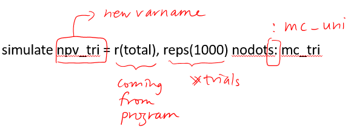
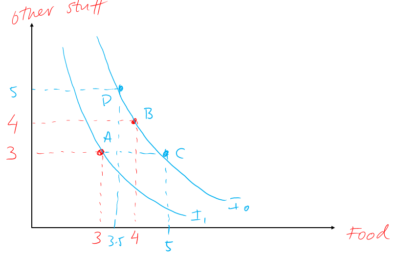
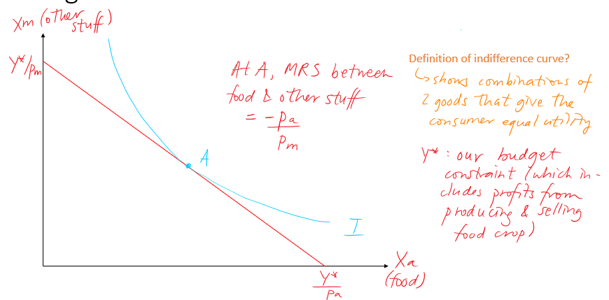
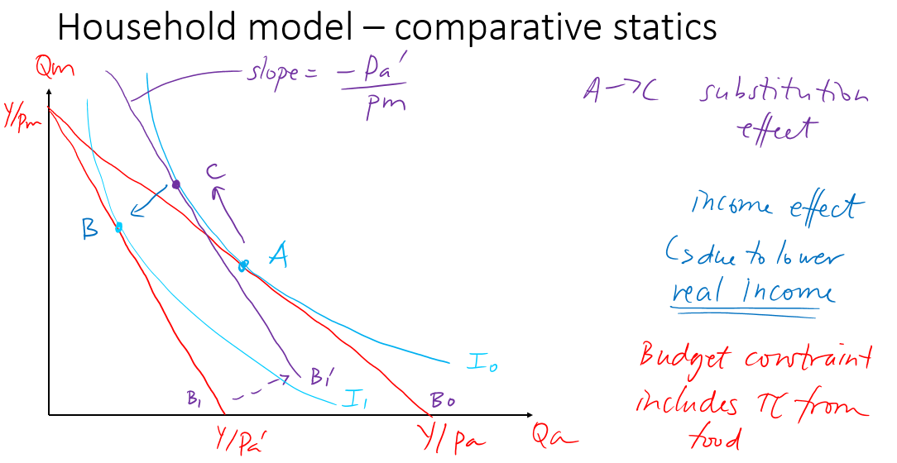
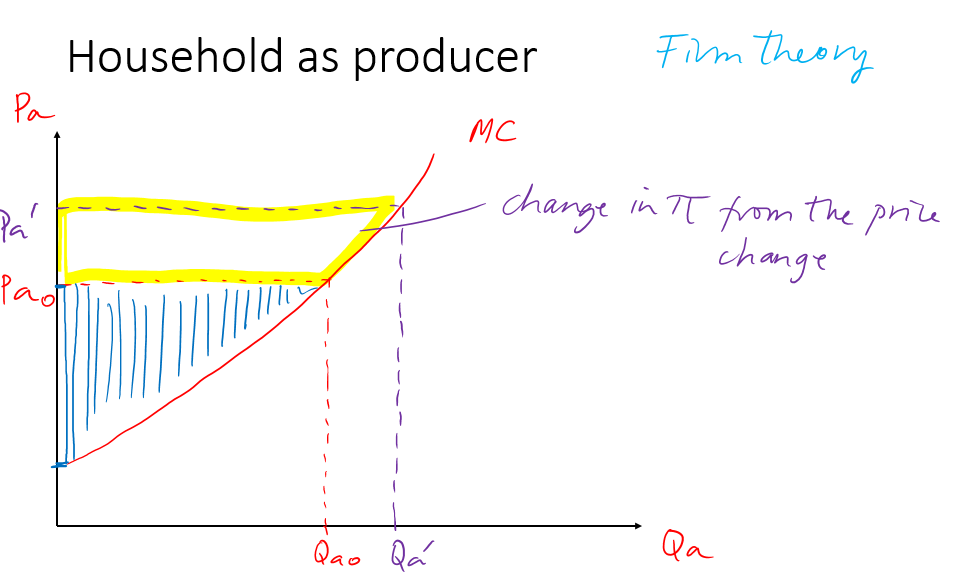
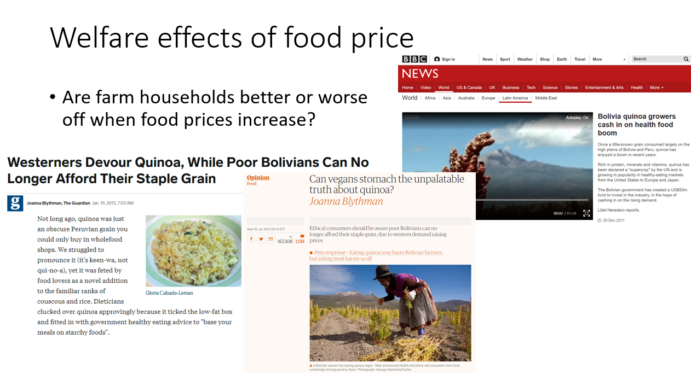
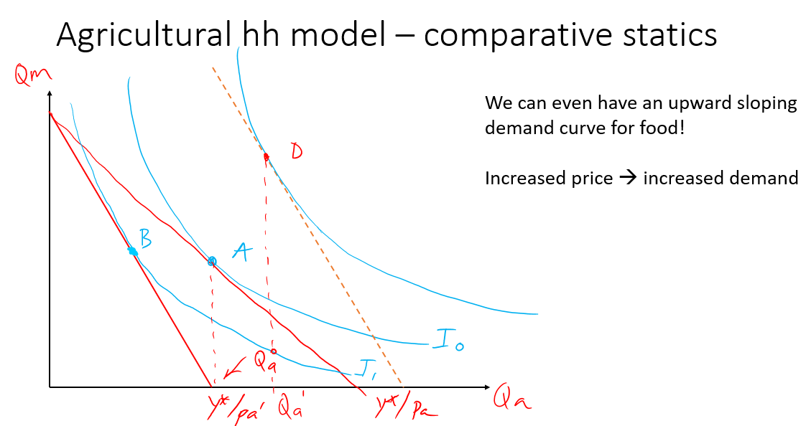
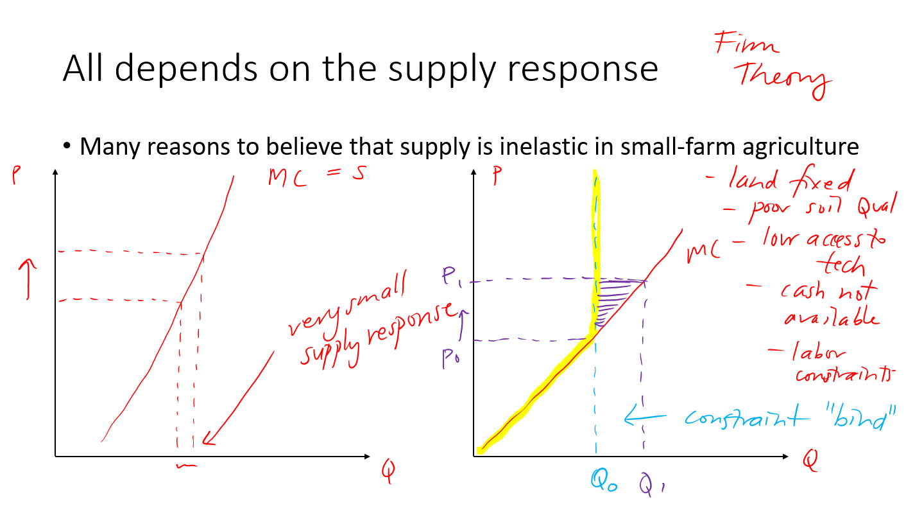
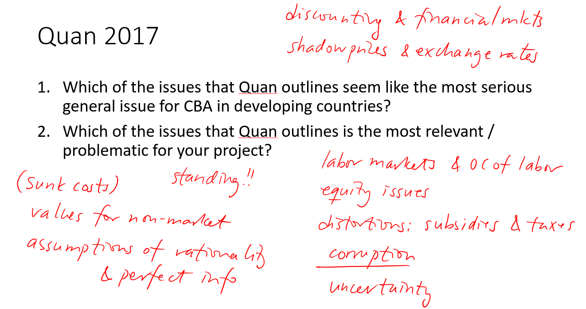

## _rattus rattus_

#### Generate benefits that look like this?
* benefits are uniformly distributed between 2 & 3
* costs in year 1 are uniformly distributed between 0.5 & 4 in year 1, 0 after that

```Stata
set obs 100
gen trial = _n
lab var trial "Trial number"

* Generate benefits
    gen benefit1_y1 = runiform(2,3)
	lab var benefit1_y1 "Benefit 1 in year 1"
    gen benefit1_y2 = runiform(2,3)
	lab var benefit1_y2 "Benefit 1 in year 2"
    gen benefit1_y3 = runiform(2,3)
	lab var benefit1_y3 "Benefit 1 in year 3"

* Generate fixed costs
    gen cost1_1 = runiform(0.5,4)
	lab var cost1_1 "Cost 1 in year 1"
    gen cost1_2 = 0
	lab var cost1_2 "Cost 1 in year 2"
    gen cost1_3 = 0
	lab var cost1_3 "Cost 1 in year 3"
```

---
#### What would you do if you had many years and many variables?
* Maybe generate a year variable and then benefits and costs from loops?

```Stata
clear all
set obs 31
gen year = _n-1
lab var year "Year"
```

```Stata
* There's an easier and cleaner way than creating a variable for each year:
* Generate a variable called year

set seed 4620739
set obs 31
gen year = _n-1
lab var year "Year"

scalar f_wage_mean = 5.935
scalar f_wage_se = 0.308
scalar days_worked = 254

* Program to run Monte Carlo with uniform
cap program drop mc_uni
program mc_uni, rclass
	version 15.1
	cap drop f_wage_dist earnings nb*
	gen f_wage_dist = runiform(f_wage_mean-f_wage_se, f_wage_mean+f_wage_se)
	gen earnings = f_wage_dist*days_worked
	gen nb = earnings/((1.05)^year)
	summarize nb
	return scalar total = r(sum)
end
```

```Stata
simulate npv_uni = r(total), reps(1000) nodots: mc_uni
hist npv_uni, scheme(plotplain) xtitle("Monte Carlo PVNB, discount rate = 5%") frac
```


---


## CBA in developing countries

### What is different about agriculture?

* Often, at least **one factor of production is fixed** (land)
* Less product differentiation
* Perishable products
* Climate dependent & risky $\rightarrow$ uncertainty in the production function
* Time lags $\rightarrow$ uncertainty about price when output materializes
* Duality of producer-consumers!
  * ag households use many of their own inputs
  * ag households consume part or often all of their output

---
### Ag household model: as consumers

1. Consumers like stuff
2. They like both food and other things and most likely they would like to consume as much as possible
3. Between (3,3) and (4,4) it is obvious which we would like, right?
4. But what about (5,3)? Or (3.5,5)?<br>
$\rightarrow$ if indifferent between these then that maps out the **indifference curve**
  > What is an indifference curve?<br> A line that shows all the combinations of 2 goods that give the consumer (household) equal utility
5. Higher indifference curve $=$ better
6. Unfortunately we can't consume as much as we want of everything; we are deciding under constraints<br>
$\rightarrow$ constraint is the budget
7. So we try to choose the highest indifference curve that we can, under the constraint of the budget line



---

### Modeling hh choices

#### 1. Start with household trade-off between food and other stuff
* Food on x-axis (which we produce)
* Everything else on y-axis
* Budget constraint that **includes profit from ag. production**
  * Y* is amount of money we have
  * $p_{a}$ = price of food (a for ag)
  * $p_{m}$ = price of other stuff  

---
#### What are the points where the budget line meets the y- & x-axes?
  >  * $\frac{Y^*}{p_{m}}$
  >  * $\frac{Y^*}{p_{a}}$
---
#### If there was no market (only eat what you produce) **how much of our own production would we consume?**<br>
  > $X_{a}^{max} = \frac{Y*}{p_{a}}$

---
#### And what's the slope of the budget line, our key constraint?<br>
  > $\frac{Y^*}{p_{m}}$ / * $\frac{Y^*}{p_{a}} = -\frac{p_a}{p_m}$<br>

#### What is the interpretation of this slope?
  > This slope tells us **how much other stuff we could buy if we gave up one unit of food**<br>
  > I.e. the rate at which **the market** trades off food for other stuff

---
#### How do we choose where to consume?<br>



---
#### What is special about point A again?
It's where **marginal rate of substitution = ratio of prices**
  >  Find this by finding the tangency point of the indifference curve and the budget line
---
### What if we increase the price of food?

* At **B** Consume less food and less other stuff
* At **C** If we could stay on same indifference curve<br>
$\rightarrow$ substitution effect, i.e. we substitute away from food


---
#### Are we done?
No! Our budget line includes profits from food production
* Producer theory
* What is on our axes when we draw firm behavior?



---
### Which of these budget lines are we looking at?


---
### So are farm hh better or worse off when prices of food increase?
**It depends!!**
  * Household gains as a producer but loses as a consumer
  * Big surplus-producing hhs gain most!
  * Net buyers will lose!


---
### Big implications for ag and food policy!
* If government wants to increase food supply for urban consumers, a policy that raises food price may not result in a big supply increase!
* In fact, **if profit response is large enough it could backfire!**
* Could lead to urban consumers paying more, with little increase in supply!
  > Second one is bad news!



---
#### The supply response depends on price elasticity of supply!
* Land is fixed
* Poor soil quality
* Low access to technology and/or information
* No insurance to protect against crop failure
* Liquidity constraints
* Labor constraints
   * some people want to respond but cannot



---
#### Lots of people don't participate in the market at all!
* How do we model people who don't participate in markets?

---
### Why do we care so much about market participation?
* What would you do if all markets disappeared tomorrow?
* You are your own market: whatever you can produce, you consume
* Note that without markets, there are no prices left in the world
* But no prices doesn't mean that you don't value things!
  * think for a second about your most valued possession, let's say that it's your phone
  * now that markets are gone, I come by your house and say "Hey nice phone"
* I suspect that your shadow value of food may have gone up without markets!
  * shadow price definition  

> Formally, a shadow price for those who have taken some optimization is **the value of the Lagrange multiplier at the optimal solution**, i.e. the infinitesimal change in the objective function arising from an infinitesimal change in the constraint

---

