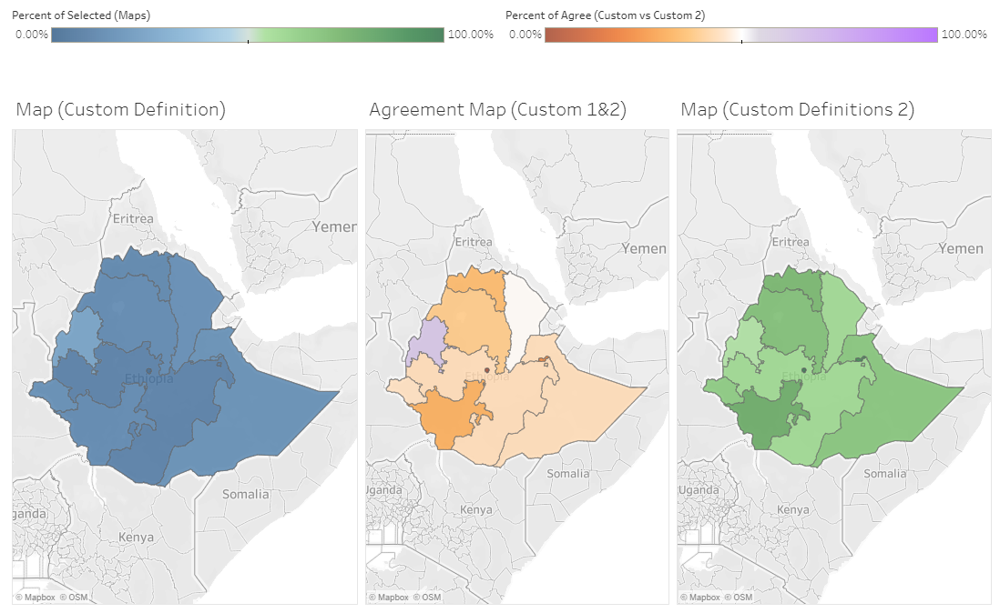

# Brief project descriptions

## 1. Payments for Eco-system Services in Burkina Faso

Conserving and restoring degraded tropical forest landscapes is a potentially cost-effective way to achieve climate mitigation. Trees could contribute to substantial reductions in greenhouse gas emissions! But of course trees don't grow on trees! How and where the conservation takes place will affect the overall benefits to society. This project will evaluate an afforestation campaign by the government of Burkina Faso.

Remote sensing estimates of tree cover in key degraded forests revealed tree cover as low as 40%.  The project involved rolling out a Payment for Environmental Services (PES) program that aimed to align individuals’ private incentives with the public environmental benefits of increased forest cover. You will evaluate the costs and benefits of this program. This will likely include calculating the project's net greenhouse gas mitigation, placing a monetary value on the project's impacts on participants' food security, and weighing these benefits against program costs. 

 
_Source: [Development Impact blog](https://blogs.worldbank.org/impactevaluations/can-pes-pay-poor-or-does-food-security-grow-trees)_

 Client: Guigonan Serge Adjognon, Economist at World Bank Development Impact Evaluation unit

---

## 2. Education and more in rural Mali

Mali is a culturally and historically rich country in the heart of West Africa, yet remains one of the poorest countries in the world in economic terms. Mali also has one of the lowest literacy rates in the world, especially among girls. Often, long distances prevent children from attending school in rural areas. In the case of Nienebale village, the nearest school was nearly 4.5 miles away. Without a bicycle, the distance was too great for small children to walk.

<figure class="video_container">
<iframe src="https://ourworldindata.org/grapher/cross-country-literacy-rates?tab=map&country=East%20Asia%20%26%20Pacific+Europe%20%26%20Central%20Asia+Latin%20America%20%26%20Caribbean+Middle%20East%20%26%20North%20Africa+South%20Asia+Sub-Saharan%20Africa&region=Africa" style="width: 100%; height: 600px; border: 0px none;">
</iframe>
</figure>

The [Mali kalanso](http://www.malikalanso.org/) project aims to change this. After fundraising efforts, the project broke ground in March 2011. The village now has a pre-school, a primary school, and a middle school. But the project does more than just the physical infrastructure, including
* water pump installation to ensure potable water access
* adult literacy programs,
* teacher training
* nutrition and sanitation programs
* toys and playgrounds
* and more...

This CBA project will attempt to simulate what the impacts of the school would be _in the absence_ of the numerous complementary programs. The goal is to better estimate the benefits of implementing a complex program filling several needs at once.

The inaugural class of 96 first-graders:
{:height="230px" width="347.5px"}
_Source: [Indiegogo campaign](https://www.indiegogo.com/projects/build-a-middle-school-with-mali-kalanso/)_

 Client: Katie Christ, co-founder Mali Kalanso

---

## 3. The value of better data: weighing the costs and benefits of improved survey methodologies

Governments, academics, civil-society organizations, and development partners recognize that high-quality data will be critical for achieving the Sustainable Development Goals (SDGs). In developing countries, household surveys are often the primary source of socio-economic data. A substantial share of such household surveys are collected by the Living Standards Measurement Study (LSMS) program at the World Bank. The LSMS project was designed to fill a need for policy-relevant data that would allow policy-makers to move from simply _measuring_ things to _understanding_ them.

For example, while it is informative to know the rates of unemployment, poverty-, and health care use in a country, good policy requires us to understand the determinants of these observed social sector outcomes. To achieve this objective, we need extensive, detailed data - the kind that the LSMS surveys collects. For example, national-level LSMS data in Nicaragua were used to improve the targeting of social programs associated with the Emergency Social Investment Fund. This resulted in the government diverting funds away from regressive sanitation projects and towards progressive education programs in extremely poor communities.

However, household surveys often suffer from low quality and limited cross-country comparability. Why might this matter? Well, definitions are hard and bad data lead to bad  policies! Getting measurement wrong can lead policy-makers astray. For example, something as seemingly simple as survey length can have [dramatic impacts on poverty rate estimates](http://blogs.worldbank.org/impactevaluations/9-pages-or-66-pages-questionnaire-design-s-impact-proxy-based-poverty-measurement). Small-scale famers are the focus of Sustainable Development Goal 2.3's target to "...double the agricultural productivity and incomes of small-scale food producers..." Yet, less than a one in five articles on the topic explicitly define what "small-scale farmer" means!

Recently, the LSMS team has embarked on a series of survey experiments within the context of the LSMS surveys. The main idea is to increase the accuracy and cost effectiveness of household and other types of survey data for sustainable development. To improve quality, timeliness, and cost-effectiveness of household survey data, the team has conducted research on survey methodology based on randomized survey experiments.

This CBA project will use detailed budgetary information and time-stamps from tablet-based data collection (allowing you to measure the additional time it took to conduct the additional measurement components for each interview) to weigh the costs of improved survey methodologies against their benefits in terms of better data and better policy insights!

 Client: Talip Kilic, Senior Economist at the World Bank Development Data Group

## 4. TBD

> Due to a client falling ill with malaria, I am reaching out to numerous folks about a replacement project. I hope to have this figured out in the next few days. 
