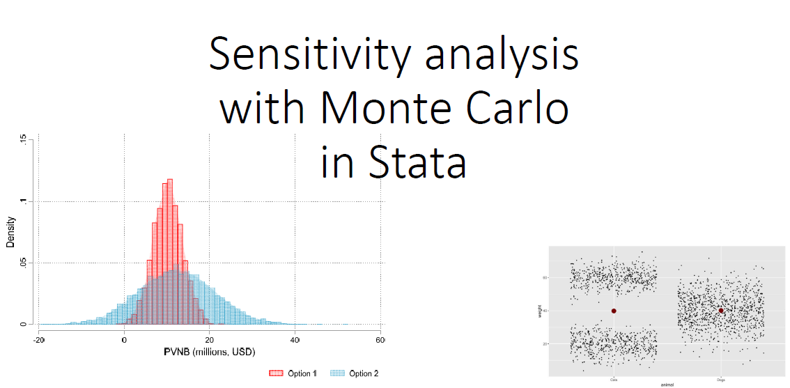

## Lecture slides linked for download here

| Lecture topic | |
| --- | --- |
|[Monte Carlo + graph tips](https://canvas.wisc.edu/files/10146269/download?download_frd=1)| |
| | >> Click [here](stata/mc_lecture.do) to download .do file |
|[CBA examples](https://canvas.wisc.edu/files/10146270/download?download_frd=1)| |
|[More examples!](https://canvas.wisc.edu/files/10217293/download?download_frd=1)| |
| | >> [Basic CBA spreadsheet](https://canvas.wisc.edu/files/10217307/download?download_frd=1)|
|[``-simulate-`` + agricultural household models](https://canvas.wisc.edu/files/10230897/download?download_frd=1)| |
