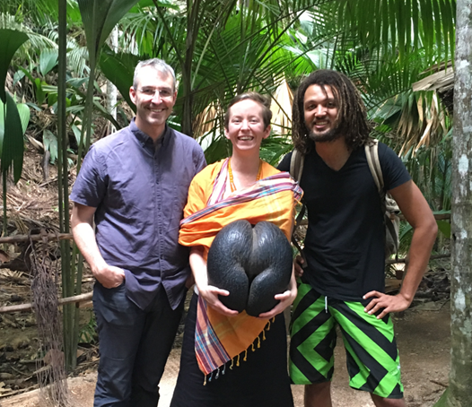
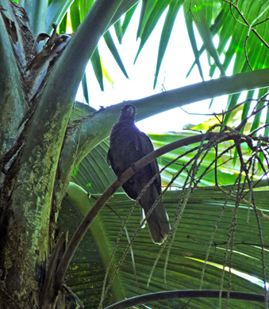
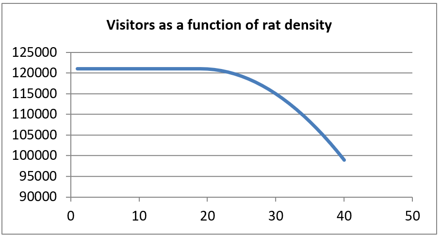

## Case Study: *Rattus rattus* at the Vallée de Mai UNESCO World Heritage Site

### Background
Located on the granitic island of Praslin in the Seychelles, the Vallée
de Mai consists of approximately 20 HA of palm forest; they remain
largely unchanged since prehistoric times. Dominating the landscape is
the world's largest population of endemic coco-de-mer (*Lodoicea
maldivica*), an endangered species of global significance as the bearer
of the largest seed in the plant kingdom.

The forest is also home to
five other endemic palms and many endemic fauna species, including the
Seychelles black parrot (*Coracopsis barklyi*) and the Seychelles frog
(*Sooglossus sechellensis*). With an estimated population of between 520
and 900 birds, the Seychelles black parrot is threatened; it is also the
national bird of the Seychelles. The Vallée de Mai was declared a UNESCO
World Heritage Site in 1983.

Tourism is the most important sector in the Seychellois economy,
accounting for well over 50% of national GDP. The Seychelles tourism
agency estimates that 40% of all of international tourists visit the
Vallée de Mai. In recent years, approximately 121,000 people visited the
World Heritage Site.

{::options parse_block_html="false"
### Details
Black rats (*Rattus rattus*) prey on young black parrots. The Seychelles
Island Foundation (SIF) [^1] have estimated that rats cause the deaths
of approximately 30% of parrot chicks prior to fledging. They also
threaten coco-de-mer and other trees by eating the tender shoots.
Comments recorded on tripadvisor.com indicate that tourists
dislike seeing rats in a place that is described in tourist
brochures as a Garden of Eden.[^2]
/}

After some limited initial trials on rat control, researchers at SIF
estimate the current population density of black rats in Vallée de Mai
to be 19 rats per hectare (380 rats total in Vallée de Mai). The
scientific literature estimates that the growth and spread of *rattus
rattus* follows a standard logistic growth function: 
$$ g\left( N \right) = bN_{0}\lbrack 1 - \frac{N_{0}}{N_{\max}}\rbrack $$

where $$ g(N) $$ is the annual change in the rat population,
and $$ b $$ is the intrinsic growth rate.

With no intervention, we believe
that the intrinsic growth rate of the rats is 0.7, as black rats are
aggressive invaders (this has earned them a spot on IUCN’s 100 Worst
Invasive Alien Species list). The carrying capacity of black rats on wet
tropical islands such as Praslin is estimated to be 40 rats per hectare
(800 rats total).

The research team at the Seychelles Island Fund is considering three
different methods for continuing its rat control efforts in Vallée de
Mai:
1. live trapping
2. poison baits
3. Goodnature self-resetting kill traps.

Undertaken at high effort levels, SIF believes that all three
methods will dramatically reduce the population density of black rats.

Live trapping is undertaken using Sherman traps, which are placed every
50 m2 (200 traps per HA, 4000 traps in total). Sherman traps
cost 600 rupees each, including freight to the Seychelles. They are
baited with chicken pellets, which are sold locally in 50kg sacks for
370 rupees each.

One year of trapping requires 5 sacks of bait per HA,
100 sacks in total. Live-caught rats are killed by putting them in sacks
and smashing them with iron bars; one set of equipment costs 600 rupees,
and researchers anticipate purchasing two sets in year 1 and 2 sets in
year 11 of the project. Dead rats are disposed of at the landfill at a
cost of 75 rupees per trip, including transportation. With live
trapping, 1 trip to the landfill is made every 2 weeks (26 trips per
year). Consumables (including gloves and other safety equipment) cost
500 rupees, and 1 set is required per year.

Each professional pest
controller is paid 140,000 rupees annually, and the staff predict
needing 1.5 full-time equivalent staff to manage the live traps.
Finally, with public education central to their mission, the Seychelles
Island Foundation plans to undertake 1 educational campaign (at a cost
of 20,000 rupees) in year 1 and every 3 years thereafter. Live trapping
is estimated to reduce the growth rate to 0.15 and to lead to a new,
stable population density of 7 rats per HA (140 rats in total).

One benefit of controlling black rats in Vallée de Mai is reducing a
known vector of leptospirosis. Treating leptospirosis costs 20,000
rupees per case, and SIF staff have estimated that 1 case of
leptospirosis originates in Vallée de Mai each year at current
infestation levels. We will assume that the number of cases of
leptospirosis originating in Vallée de Mai is a linear function of the
population density of rats (i.e., the damage $$ = \frac{1}{19} \times $$ the rat population).

While 121,000 international tourists
currently visit Vallée de Mai each year, staff at SIF believe that
tourism numbers will drop if the population density of rats increases.
Specifically, they believe that the number of tourists that choose *not*
to visit Vallée de Mai will increase exponentially with the population
density of black rats. Tourists spend 350 rupees in entrance fees and a
further 170 rupees in the café and gift shop operated by the Seychelles
Island Foundation, on average. They estimate that the total amount of
lost revenue due to rats is the following: 

$$ 50 \times \left( rat\ population - 19\right))^{2} $$

### Sensitivity analysis

1. *What if we were uncertain about the growth rate under trapping?* 
  > Conduct a Monte Carlo simulation allowing the growth rate, $c$, to
vary between 0.1 and 0.2 (assume that the variable is distributed uniformly).
2.  *What if we are uncertain about the number of missing tourists due to rats?*  
  > Allow it to vary between 
  > $$ 25 \times \left( rat population-19 \right)^{2} $$ and 
  > $$ 75 \times \left( rat population-19 \right)^{2} $$.

#### Footnotes
{::options parse_block_html="false" 
[^1]: SIF is a public trust that operates the Vallée de Mai on behalf of
the Seychelles government. 
[^2]: We will not attempt to place a monetary value on the dead parrots in
this exercise. 
/}
